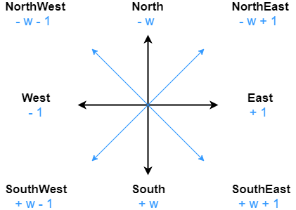

# Relative position

Remember: a cell is nothing else than a bitboard with **only one bit to 1** (commonly called **_one-hot vector_**). In the following, we will see how to move this bit wherever on the board.

# Get and set relative cell



# Moving value

We want to **move** an element from (x1,y1) to (x2,y2) coordinates. In other words: we want to set the **bit n° _bitpos1_ at 0** and set the **bit n° _bitpos2_ at 1**.

We could eventually use the "set" function on the two cells, but we have a mean to get the same result with a more bit-friendly operation that uses the **SHIFT operator** $`<<`$ or $`>>`$.

How can we achieve that ?

In fact moving a bit simply consists in right or left-shifting the cell representation.

```math
position = bitboard \vee (1 \ll bitpos)
```

We can write it up:

```C++
Bitboard setCell(Bitboard bitboard, int x, int y) {
    return bitboard | (1 << (y * 3 + x));
}
```
